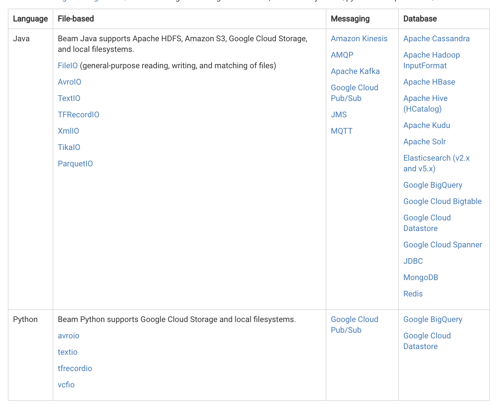

# Apache Beam

### Description

For now Apache Beam has SDK for Java, Python and Go.  
[https://beam.apache.org/documentation/](https://beam.apache.org/documentation/)

Apache Beam is actually new SDK for Google Cloud Dataflow.

Cloud Dataflow is a fully-managed service for transforming and enriching data in [stream](https://cloud.google.com/solutions/big-data/stream-analytics/) \(real time\) and batch \(historical\) modes with equal reliability and expressiveness -- no more complex workarounds or compromises needed. And with its serverless approach to resource provisioning and management, you have access to virtually limitless capacity to solve your biggest data processing challenges, while paying only for what you use.

Cloud Dataflow unlocks transformational use cases across industries, including:

* Clickstream, Point-of-Sale, and segmentation analysis in retail
* Fraud detection in financial services
* Personalized user experience in gaming
* IoT analytics in manufacturing, healthcare, and logistics

### References

* [https://cloud.google.com/dataflow/](https://cloud.google.com/dataflow/)
* [https://beam.apache.org/](https://beam.apache.org/)
* [https://beam.apache.org/documentation/runners/capability-matrix/](https://beam.apache.org/documentation/runners/capability-matrix/)
* [https://beam.apache.org/documentation/programming-guide/](https://beam.apache.org/documentation/programming-guide/)
* [https://beam.apache.org/documentation/programming-guide/\#applying-transforms](https://beam.apache.org/documentation/programming-guide/#applying-transforms)
* [https://beam.apache.org/documentation/pipelines/design-your-pipeline/\#multiple-sources](https://beam.apache.org/documentation/pipelines/design-your-pipeline/#multiple-sources)
* [https://beam.apache.org/documentation/programming-guide/\#pipeline-io](https://beam.apache.org/documentation/programming-guide/#pipeline-io)
* [https://beam.apache.org/documentation/programming-guide/\#watermarks-and-late-data](https://beam.apache.org/documentation/programming-guide/#watermarks-and-late-data)
* [https://beam.apache.org/documentation/programming-guide/\#triggers](https://beam.apache.org/documentation/programming-guide/#triggers)
* [https://cloud.google.com/dataflow/pipelines/dataflow-monitoring-intf](https://cloud.google.com/dataflow/pipelines/dataflow-monitoring-intf)
* [https://cloud.google.com/blog/big-data/2017/06/guide-to-common-cloud-dataflow-use-case-patterns-part-1](https://cloud.google.com/blog/big-data/2017/06/guide-to-common-cloud-dataflow-use-case-patterns-part-1) and [https://cloud.google.com/blog/big-data/2017/08/guide-to-common-cloud-dataflow-use-case-patterns-part-2](https://cloud.google.com/blog/big-data/2017/08/guide-to-common-cloud-dataflow-use-case-patterns-part-2) \(use cases\) 
* [https://cloud.google.com/blog/big-data/2016/04/scheduling-dataflow-pipelines-using-app-engine-cron-service-or-cloud-functions](https://cloud.google.com/blog/big-data/2016/04/scheduling-dataflow-pipelines-using-app-engine-cron-service-or-cloud-functions)
* [https://cloud.google.com/blog/big-data/2016/01/handling-invalid-inputs-in-dataflow](https://cloud.google.com/blog/big-data/2016/01/handling-invalid-inputs-in-dataflow)
* [https://beam.apache.org/documentation/programming-guide/\#groupbykey](https://beam.apache.org/documentation/programming-guide/#groupbykey)
* [https://cloud.google.com/dataflow/service/dataflow-service-desc\#error-and-exception-handling](https://cloud.google.com/dataflow/service/dataflow-service-desc#error-and-exception-handling)
* [https://beam.apache.org/documentation/io/built-in/](https://beam.apache.org/documentation/io/built-in/) \(build-in transforms IO\)
* [https://github.com/apache/beam/tree/master/sdks/java/io](https://github.com/apache/beam/tree/master/sdks/java/io)
* [https://cloud.google.com/dataflow/faq](https://cloud.google.com/dataflow/faq)
* [https://medium.com/google-cloud/restarting-cloud-dataflow-in-flight-9c688c49adfd](https://medium.com/google-cloud/restarting-cloud-dataflow-in-flight-9c688c49adfd) restart/update google dataflow
* [https://cloud.google.com/blog/big-data/2016/04/debugging-data-transformations-using-cloud-dataflow-and-stackdriver-debugger](https://cloud.google.com/blog/big-data/2016/04/debugging-data-transformations-using-cloud-dataflow-and-stackdriver-debugger) debug
* [https://cloud.google.com/dataflow/docs/concepts/sdk-worker-dependencies](https://cloud.google.com/dataflow/docs/concepts/sdk-worker-dependencies) dependencies
* [https://cloud.google.com/dataflow/pipelines/troubleshooting-your-pipeline\#rpc-timed-out-exceptions-deadline\_exceeded-exceptions-or-server-unresponsive-errors](https://cloud.google.com/dataflow/pipelines/troubleshooting-your-pipeline#rpc-timed-out-exceptions-deadline_exceeded-exceptions-or-server-unresponsive-errors)
* [https://cloud.google.com/dataflow/service/dataflow-service-desc\#autoscaling](https://cloud.google.com/dataflow/service/dataflow-service-desc#autoscaling)
* Old docs [https://cloud.google.com/dataflow/docs/](https://cloud.google.com/dataflow/docs/)
* Old docs [https://cloud.google.com/dataflow/model/custom-io](https://cloud.google.com/dataflow/model/custom-io)
* [https://beam.apache.org/blog/2017/08/28/timely-processing.html](https://beam.apache.org/blog/2017/08/28/timely-processing.html) \(and Batched RPC\)

**Tutorials & examples**

* [https://beam.apache.org/get-started/quickstart-java/](https://beam.apache.org/get-started/quickstart-java/)
* [https://beam.apache.org/get-started/quickstart-py/](https://beam.apache.org/get-started/quickstart-py/)
* [https://beam.apache.org/get-started/quickstart-go/](https://beam.apache.org/get-started/quickstart-go/)
* [https://github.com/apache/beam/tree/master/examples/java/src/main/java/org/apache/beam/examples](https://github.com/apache/beam/tree/master/examples/java/src/main/java/org/apache/beam/examples)
* [https://github.com/eljefe6a/beamexample/tree/master/BeamTutorial/src/main/java/org/apache/beam/examples/tutorial/game](https://github.com/eljefe6a/beamexample/tree/master/BeamTutorial/src/main/java/org/apache/beam/examples/tutorial/game)
* [https://github.com/apache/beam/blob/master/sdks/java/core/src/main/java/org/apache/beam/sdk/io/CountingSource.java\#L33:47](https://github.com/apache/beam/blob/master/sdks/java/core/src/main/java/org/apache/beam/sdk/io/CountingSource.java#L33:47)

**Understanding Streaming** 

* [https://www.oreilly.com/ideas/the-world-beyond-batch-streaming-101](https://www.oreilly.com/ideas/the-world-beyond-batch-streaming-101)
* [https://www.oreilly.com/ideas/the-world-beyond-batch-streaming-102](https://www.oreilly.com/ideas/the-world-beyond-batch-streaming-102)

### Google Dataflow Pipeline example

### Talks

- Serverless data processing with Google Cloud Dataflow \(Google Cloud Next '17\) [http://youtube.com/watch?v=3BrcmUqWNm0](http://youtube.com/watch?v=3BrcmUqWNm0)  
- Apache Beam: Portable and Parallel Data Processing \(Google Cloud Next '17\) [https://www.youtube.com/watch?v=owTuuVt6Oro](https://www.youtube.com/watch?v=owTuuVt6Oro)

### Built-in Transforms



### How are Java exceptions handled in Dataflow?

Your pipeline may throw exceptions while processing data. Some of these errors are transient \(e.g., temporary difficulty accessing an external service\), but some are permanent, such as errors caused by corrupt or unparseable input data, or null pointers during computation.

Dataflow processes elements in arbitrary bundles, and will retry the complete bundle when an error is thrown for any element in that bundle. When running in batch mode, bundles including a failing item are retried 4 times. The pipeline will fail completely when a single bundle has failed 4 times. When running in streaming mode, a bundle including a failing item will be retried indefinitely, which may cause your pipeline to permanently stall.

Exceptions in user code \(for example, your `DoFn` instances\) are reported in the [Dataflow Monitoring Interface](https://cloud.google.com/dataflow/pipelines/dataflow-monitoring-intf). If you run your pipeline with `BlockingDataflowPipelineRunner`, you'll also see error messages printed in your console or terminal window.

Consider guarding against errors in your code by adding exception handlers. For example, if you'd like to drop elements that fail some custom input validation done in a `ParDo`, use a try/catch block within your `ParDo` to handle the exception and drop the element. You may also want to use an [`Aggregator`](https://cloud.google.com/dataflow/java-sdk/JavaDoc/com/google/cloud/dataflow/sdk/transforms/Aggregator) to keep track of error counts.

### Interesting stuff

* [https://github.com/tuanavu/google-dataflow-examples](https://github.com/tuanavu/google-dataflow-examples) \(examples with Jupyter Notebook\)
* [https://labs.spotify.com/2016/02/25/spotifys-event-delivery-the-road-to-the-cloud-part-i/](https://labs.spotify.com/2016/02/25/spotifys-event-delivery-the-road-to-the-cloud-part-i/)
* [https://labs.spotify.com/2016/03/03/spotifys-event-delivery-the-road-to-the-cloud-part-ii/](https://labs.spotify.com/2016/03/03/spotifys-event-delivery-the-road-to-the-cloud-part-ii/)
* [https://labs.spotify.com/2016/03/10/spotifys-event-delivery-the-road-to-the-cloud-part-iii/](https://labs.spotify.com/2016/03/10/spotifys-event-delivery-the-road-to-the-cloud-part-iii/) \(Google Dataflow here\)
* [https://medium.com/@0x0ece/a-quick-demo-of-apache-beam-with-docker-da98b99a502a](https://medium.com/@0x0ece/a-quick-demo-of-apache-beam-with-docker-da98b99a502a) \(with Apache Flink\)
* [https://stackoverflow.com/questions/45642292/apache-beam-job-stalled-on-google-cloud-cpu-is-high](https://stackoverflow.com/questions/45642292/apache-beam-job-stalled-on-google-cloud-cpu-is-high)

